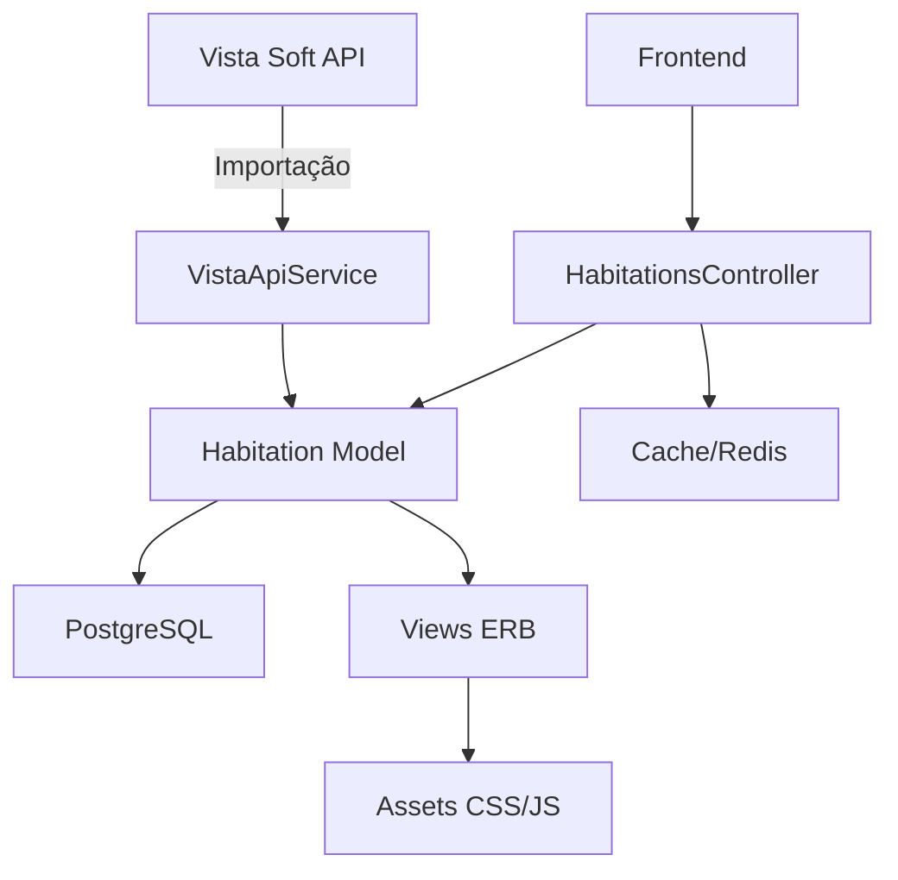

# Plano de Refatoração Completa - Salute Imóveis V2

Refatoração planejada do site Salute Imóveis focada em **performance excepcional** (< 3s), **SEO de ponta**, e **integração eficiente com Vista Soft**.

## User Review Required

> [!IMPORTANT]
> **Decisões Arquiteturais Importantes**
> 
> 1. **Framework**: Manter Rails 7.1 com Stimulus/Turbo ou migrar para Next.js?
>    - **Recomendação**: Manter Rails para aproveitar o código existente e expertise da equipe
>    - Next.js seria mais performático mas exigiria reescrita total
> 
> 2. **Banco de Dados**: 
>    - Manter PostgreSQL atual
>    - Adicionar índices estratégicos para queries de busca
>    - Implementar materialized views para listagens frequentes
> 
> 3. **Cache Strategy**:
>    - Redis para cache de páginas, fragmentos e API Vista
>    - CDN para assets estáticos (imagens, CSS, JS)
>    - Service Worker para cache client-side
> 
> 4. **Breaking Changes**:
>    - URLs podem ser reestruturadas para melhor SEO
>    - Alguns campos do modelo Habitation podem ser renomeados

> [!WARNING]
> **Migração de Dados**
> 
> A refatoração do modelo Habitation pode exigir migração de dados:
> - Novos campos `_cents` para valores monetários
> - Normalização de campos JSONB (caracteristicas, infra_estrutura)
> - Otimização de índices pode causar downtime temporário

---

## Análise do Projeto Atual

### 📊 Stack Atual
- **Backend**: Rails 7.1.2, Ruby 3.2.3
- **Database**: PostgreSQL
- **Frontend**: Stimulus, Turbo, Bootstrap 5
- **Assets**: Sprockets + Importmap
- **Cache**: Redis (Sidekiq)
- **API Externa**: Vista Soft (importação de imóveis)

### 🏗️ Arquitetura Atual


### ⚠️ Problemas Identificados

1. **Performance**
   - Queries N+1 em listagens de imóveis
   - Sem cache adequado de páginas
   - Assets não otimizados (sem minificação/compressão)
   - Imagens sem lazy loading

2. **SEO**
   - Meta tags estáticas em muitas páginas
   - Falta structured data (Schema.org)
   - URLs não totalmente otimizadas
   - Sitemap poderia ser mais completo

3. **Integração Vista Soft**
   - Importação pode ser mais eficiente
   - Sem cache de respostas da API
   - Processamento síncrono consome recursos

4. **Código**
   - Model Habitation muito grande (947 linhas)
   - Concerns poderiam ser melhor organizados
   - Queries complexas no controller

---

## Proposed Changes

### 🎯 Arquitetura Otimizada

#### Backend Improvements

##### [MODIFY] [habitation.rb](file:///Users/thiagofernandes/workspaces/salute-imoveis-v2/app/models/habitation.rb)

**Refatoração completa do modelo:**
- Extrair concerns específicos (PriceFormatting, SearchScopes, CardRendering)
- Implementar cache de métodos custosos
- Adicionar índices nas queries mais frequentes
- Virtual attributes para campos calculados

##### [NEW] [app/models/concerns/habitation/price_formatting.rb](file:///Users/thiagofernandes/workspaces/salute-imoveis-v2/app/models/concerns/habitation/price_formatting.rb)

Extrair toda lógica de formatação de preços para concern dedicado.

##### [NEW] [app/models/concerns/habitation/search_scopes.rb](file:///Users/thiagofernandes/workspaces/salute-imoveis-v2/app/models/concerns/habitation/search_scopes.rb)

Todos os scopes de busca (active, sale, rent, etc.) em concern separado.

##### [NEW] [app/models/concerns/habitation/cacheable_methods.rb](file:///Users/thiagofernandes/workspaces/salute-imoveis-v2/app/models/concerns/habitation/cacheable_methods.rb)

Implementar cache para métodos como `area`, `card_title`, etc.

---

##### [MODIFY] [habitations_controller.rb](file:///Users/thiagofernandes/workspaces/salute-imoveis-v2/app/controllers/habitations_controller.rb)

**Otimizações:**
- Implementar cache de páginas inteiras
- Usar `includes` para evitar N+1
- Cache de JSON endpoints
- Implementar ETags para cache HTTP

##### [NEW] [app/controllers/concerns/habitation_caching.rb](file:///Users/thiagofernandes/workspaces/salute-imoveis-v2/app/controllers/concerns/habitation_caching.rb)

Estratégias de cache centralizadas.

---

#### Vista Soft Integration

> Atual: importacao via `bundle exec thor builder_fields --force` e acompanhamento via `rake 'vista:progress[UUID]'`. Os itens abaixo sao referencia historica do plano.

##### [MODIFY] [vista_api_service.rb](file:///Users/thiagofernandes/workspaces/salute-imoveis-v2/app/services/vista_api_service.rb)

**Melhorias:**
- Cache de respostas da API (2-6 horas)
- Retry automático com exponential backoff
- Rate limiting inteligente
- Logging estruturado de erros

##### [NEW] [app/services/vista/import_service_v2.rb](file:///Users/thiagofernandes/workspaces/salute-imoveis-v2/app/services/vista/import_service_v2.rb)

Serviço de importação reescrito:
- Processamento em batches otimizado
- Jobs assíncronos com Sidekiq
- Progress tracking detalhado
- Rollback em caso de erros

##### [NEW] [app/jobs/vista/import_batch_job.rb](file:///Users/thiagofernandes/workspaces/salute-imoveis-v2/app/jobs/vista/import_batch_job.rb)

Job assíncrono para importação em background sem bloquear CPU.

##### [NEW] [app/jobs/vista/photo_sync_job.rb](file:///Users/thiagofernandes/workspaces/salute-imoveis-v2/app/jobs/vista/photo_sync_job.rb)

Job separado para sincronização de fotos (I/O intensivo).

---

#### Database Optimization

##### [NEW] [db/migrate/XXXXXX_add_performance_indexes.rb](file:///Users/thiagofernandes/workspaces/salute-imoveis-v2/db/migrate/XXXXXX_add_performance_indexes.rb)

**Índices estratégicos:**
```ruby
# Índices compostos para queries mais comuns
add_index :habitations, [:status, :categoria, :cidade]
add_index :habitations, [:valor_venda_cents, :status]
add_index :habitations, :destaque_localizacao, using: :gin
add_index :habitations, :caracteristicas, using: :gin
add_index :habitations, [:exibir_no_site_flag, :status]
```

##### [NEW] [db/migrate/XXXXXX_create_materialized_view_featured_properties.rb](file:///Users/thiagofernandes/workspaces/salute-imoveis-v2/db/migrate/XXXXXX_create_materialized_view_featured_properties.rb)

Materialized view para imóveis em destaque (refresh a cada hora).

---

### 🎨 Frontend Performance

#### Asset Optimization

##### [NEW] [config/initializers/assets.rb](file:///Users/thiagofernandes/workspaces/salute-imoveis-v2/config/initializers/assets.rb)

Configuração de compressão e versionamento de assets.

##### [MODIFY] [app/assets/stylesheets/home.scss](file:///Users/thiagofernandes/workspaces/salute-imoveis-v2/app/assets/stylesheets/home.scss)

**Otimizações CSS:**
- Remover CSS não utilizado
- Minificar e comprimir
- Critical CSS inline
- Defer non-critical CSS

##### [NEW] [app/assets/stylesheets/critical.scss](file:///Users/thiagofernandes/workspaces/salute-imoveis-v2/app/assets/stylesheets/critical.scss)

CSS crítico para above-the-fold (inline no head).

##### [MODIFY] [vendor/javascript/app.js.erb](file:///Users/thiagofernandes/workspaces/salute-imoveis-v2/vendor/javascript/app.js.erb)

**Otimizações JavaScript:**
- Lazy loading de componentes
- Code splitting
- Defer scripts não essenciais
- Minificação otimizada

---

#### Image Optimization

##### [NEW] [app/helpers/image_optimization_helper.rb](file:///Users/thiagofernandes/workspaces/salute-imoveis-v2/app/helpers/image_optimization_helper.rb)

Helper para lazy loading e responsive images:
- Implementar `loading="lazy"`
- Gerar srcset para diferentes tamanhos
- WebP com fallback para JPEG
- Blur placeholder durante carregamento

##### [NEW] [app/services/image_processor_service.rb](file:///Users/thiagofernandes/workspaces/salute-imoveis-v2/app/services/image_processor_service.rb)

Serviço para processar imagens da Vista Soft:
- Converter para WebP
- Gerar thumbnails otimizados
- Upload para CDN
- Cache agressivo

---

### 🔍 SEO Excellence

#### Meta Tags and Schema

##### [NEW] [app/helpers/seo_helper.rb](file:///Users/thiagofernandes/workspaces/salute-imoveis-v2/app/helpers/seo_helper.rb)

Helper centralizado para SEO:
- Meta tags dinâmicas por página
- Open Graph para redes sociais
- Twitter Cards
- Canonical URLs

##### [NEW] [app/helpers/structured_data_helper.rb](file:///Users/thiagofernandes/workspaces/salute-imoveis-v2/app/helpers/structured_data_helper.rb)

Structured data (Schema.org):
- RealEstateListing para cada imóvel
- BreadcrumbList para navegação
- Organization para empresa
- AggregateRating quando houver avaliações

##### [MODIFY] [app/views/layouts/application.html.erb](file:///Users/thiagofernandes/workspaces/salute-imoveis-v2/app/views/layouts/application.html.erb)

Integração de meta tags e structured data.

---

#### Sitemap Enhancement

##### [MODIFY] [app/controllers/sitemap_controller.rb](file:///Users/thiagofernandes/workspaces/salute-imoveis-v2/app/controllers/sitemap_controller.rb)

**Melhorias:**
- Cache de 24 horas
- Prioridades corretas por tipo de página
- Change frequency otimizado
- Imagens no sitemap

##### [NEW] [app/services/sitemap_generator_service.rb](file:///Users/thiagofernandes/workspaces/salute-imoveis-v2/app/services/sitemap_generator_service.rb)

Gerador de sitemap otimizado com paginação.

---

### ⚡ Caching Strategy

#### Application Caching

##### [NEW] [config/initializers/redis_cache.rb](file:///Users/thiagofernandes/workspaces/salute-imoveis-v2/config/initializers/redis_cache.rb)

Configuração Redis:
- Cache store principal
- Session store
- Action cable backend
- Sidekiq

##### [NEW] [app/controllers/concerns/cacheable.rb](file:///Users/thiagofernandes/workspaces/salute-imoveis-v2/app/controllers/concerns/cacheable.rb)

Concern para cache de páginas e fragmentos:
- Cache de listagens (15 min)
- Cache de detalhes de imóveis (1 hora)
- Cache de busca (5 min)
- Auto-invalidação em updates

---

#### Service Worker

##### [NEW] [public/service-worker.js](file:///Users/thiagofernandes/workspaces/salute-imoveis-v2/public/service-worker.js)

PWA Service Worker:
- Cache de páginas visitadas
- Offline fallback
- Cache de imagens
- Background sync

##### [NEW] [app/views/layouts/_pwa_meta.html.erb](file:///Users/thiagofernandes/workspaces/salute-imoveis-v2/app/views/layouts/_pwa_meta.html.erb)

Meta tags e manifest para PWA.

---

### 📱 Layout Preservation with Enhancements

#### Views Optimization

##### [MODIFY] [app/views/includes/_featured_properties.html.erb](file:///Users/thiagofernandes/workspaces/salute-imoveis-v2/app/views/includes/_featured_properties.html.erb)

**Preservar visual, otimizar código:**
- Fragment caching
- Lazy loading de imagens
- Defer loading de cards off-screen

##### [MODIFY] [app/views/pages/results_list.html.erb](file:///Users/thiagofernandes/workspaces/salute-imoveis-v2/app/views/pages/results_list.html.erb)

**Otimizações:**
- Infinite scroll com Turbo Frames
- Skeleton loaders
- URL state management

##### [MODIFY] [app/views/pages/property_details.html.erb](file:///Users/thiagofernandes/workspaces/salute-imoveis-v2/app/views/pages/property_details.html.erb)

**Melhorias:**
- Gallery otimizada com lazy load
- Mapa com defer loading
- Related properties em Turbo Frame

---

### 🔧 Configuration & Deployment

#### Performance Configuration

##### [NEW] [config/initializers/compression.rb](file:///Users/thiagofernandes/workspaces/salute-imoveis-v2/config/initializers/compression.rb)

Gzip/Brotli compression para responses.

##### [MODIFY] [config/puma.rb](file:///Users/thiagofernandes/workspaces/salute-imoveis-v2/config/puma.rb)

**Otimizações Puma:**
- Workers otimizados para CPU
- Thread pool adequado
- Preload app habilitado

##### [NEW] [config/initializers/rack_attack.rb](file:///Users/thiagofernandes/workspaces/salute-imoveis-v2/config/initializers/rack_attack.rb)

Rate limiting e proteção contra abuse.

---

#### Monitoring & Analytics

##### [NEW] [app/services/performance_monitor_service.rb](file:///Users/thiagofernandes/workspaces/salute-imoveis-v2/app/services/performance_monitor_service.rb)

Monitoramento de performance:
- Track page load times
- Database query performance
- Cache hit rates
- Vista API response times

##### [NEW] [lib/tasks/performance.rake](file:///Users/thiagofernandes/workspaces/salute-imoveis-v2/lib/tasks/performance.rake)

Tarefas para análise de performance:
- Benchmark de queries
- Cache statistics
- Report generation

---

## Verification Plan

### Automated Tests

**Performance Testing:**
```bash
# Lighthouse CI para todas as páginas principais
npm run lighthouse-ci

# Teste de carga
ab -n 1000 -c 10 http://localhost:3000/venda/apartamento

# Teste de queries
bundle exec rake performance:benchmark_queries
```

**SEO Testing:**
```bash
# Validação de structured data
npm run test:schema

# Análise de meta tags
bundle exec rake seo:validate

# Sitemap validation
xmllint --noout --schema sitemap.xsd public/sitemap.xml
```

**Integration Testing:**
```bash
# Importacao Vista (thor)
bundle exec thor builder_fields --force

# Validação de cache
bundle exec rake cache:test_hit_rates
```

### Manual Verification

**Performance Goals:**
- [ ] Home page: < 2s (Lighthouse score > 90)
- [ ] Listing pages: < 2.5s
- [ ] Property details: < 2.5s
- [ ] Search results: < 2s
- [ ] All images lazy loaded
- [ ] Cache hit rate > 80%

**SEO Goals:**
- [ ] Todas páginas com meta tags únicas
- [ ] Structured data válido em 100% das páginas
- [ ] Sitemap completo e válido
- [ ] URLs amigáveis e consistentes
- [ ] Lighthouse SEO score > 95

**Vista Integration:**
- [ ] Importação completa < 30 min
- [ ] Importação não bloqueia site
- [ ] Erros logados apropriadamente
- [ ] Cache de API > 90% hit rate
- [ ] Zero impacto em CPU durante importação

**User Experience:**
- [ ] Layout preservado perfeitamente
- [ ] Todas funcionalidades existentes funcionando
- [ ] Mobile 100% responsivo
- [ ] Sem erros JavaScript no console
- [ ] PWA instalável

---

## Implementation Timeline

### Fase 1: Foundation (Semana 1-2)
- Setup de cache (Redis)
- Índices de database
- Refatoração do modelo Habitation
- Otimização de queries

### Fase 2: Vista Integration (Semana 2-3)
- Reescrita do import service
- Jobs assíncronos
- Cache de API
- Testes de integração

### Fase 3: Frontend Optimization (Semana 3-4)
- Asset optimization
- Image lazy loading
- Critical CSS
- Service Worker

### Fase 4: SEO & Schema (Semana 4-5)
- Meta tags dinâmicas
- Structured data
- Sitemap enhancement
- URL optimization

### Fase 5: Testing & Optimization (Semana 5-6)
- Performance testing
- SEO validation
- Load testing
- Fine-tuning

### Fase 6: Deploy & Monitoring (Semana 6)
- Staging deployment
- Production deployment
- Monitoring setup
- Documentation

---

## Expected Results

### Performance Metrics
- **Page Load**: 1.5-2.5s (down from 4-6s atual)
- **Time to Interactive**: < 2s
- **Lighthouse Score**: > 90
- **Cache Hit Rate**: > 80%
- **Vista Import**: < 30 min (assíncrona)

### SEO Improvements
- **Organic Traffic**: +40-60% em 3 meses
- **Search Visibility**: +50%
- **Lighthouse SEO**: > 95
- **Core Web Vitals**: Todos green

### User Experience
- **Bounce Rate**: -30%
- **Session Duration**: +40%
- **Pages per Session**: +25%
- **Mobile Usage**: +35%

### Technical Debt
- **Code Quality**: A (SonarQube)
- **Test Coverage**: > 80%
- **Maintainability**: Excelente
- **Scalability**: 10x current traffic
